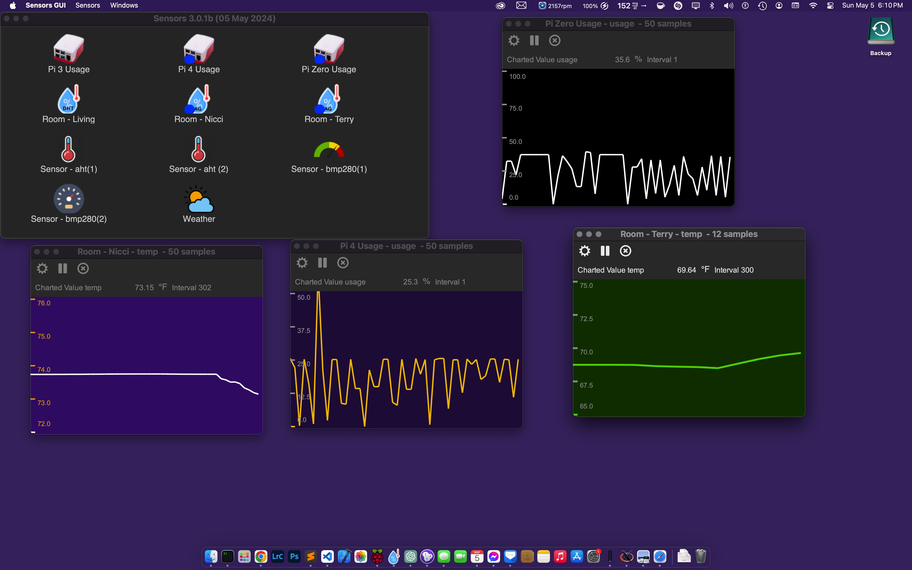

# Sensors
This is a demonstration of using my SensorFS and RestAPI to collect and display data using Gtk 
*Warning* I suck at Python GTK programming! 

I have tested this on my Raspberry Pi4 but mainly run this on macOS Sonoma. This likely will not 
run on your system without teaking paths and creating ramdisks. 

## Overview
There are two components: First is get-data.py which forks and runs in background. If the daemon isn't 
started when the main app runs, the daemon is started automatically.

The main program presents a window with icons representing each defined sensors. Buttons on a toolbar 
allow app and sensor configuration. (changes to this will be reflected on the daemon)

Double-clicking an icon brings up a detail window. If there is already a detail window open, that window is raised.

Icons can be sorted by name or type in ascending or descending direction. 

## Installation
Well, this is the fun bit isn't it. 

Frist, clone this repository into where it will run. 

Since this was made for my mac with a ramdisk on /Volumes/RamDisk and data stored on /Volumes/RamDisk/sensordata. To change this location get-data.py must be edited and sendetail must be edited to relect the place to store and read data. 

This program is meant to run from it's own directory. See prog_dir in sensors.py and get-data.py. 

