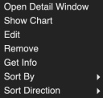

# Sensors
This is a demonstration of using my SensorFS and RestAPI to collect and display data using Gtk 
*Warning* I suck at Python GTK programming! 

## Caveat Emptor
This is demonstration code and not really written for distribution, nor, will it be, this is part of a proof of concept for my [SensorFS Proposal](https://github.com/nicciniamh/sensorfs).

I have tested this on my Raspberry Pi4 but mainly run this on macOS Sonoma. This likely will not 
run on your system without teaking paths and creating ramdisks. 

## Overview
The main program presents a window with icons representing each defined sensors. Buttons on a toolbar allow app and sensor configuration. (changes to this will be reflected on the daemon)

Double-clicking an icon brings up a detail window. If there is already a detail window open, that window is raised.
Right clicking an icon brings up a context menu with: 

From here you can open a detail window, show a chart of a data point for that sensor, remove the sensor, get information on the sensor, edit the sensor and sort in various ways. 

Icons can be sorted by name or type in ascending or descending direction. 

## Installation
Well, this is the fun bit isn't it. 

Frist, clone this repository into where it will run. You will need to copy or rename sensors.json.dist to sensors.json. 

Since this was made for my mac with a ramdisk on /Volumes/RamDisk and data stored on /Volumes/RamDisk/sensordata. To change this location get-data.py must be edited and sendetail must be edited to relect the place to store and read data. 

The daemon writes data anywhere from 200ms to 2000ms. This can fatique solid state media and really should be done on a ramdisk. 

This program is meant to run from it's own directory. See prog_dir in sensors.py and get-data.py. 

# Intellectual Property
I have glomed some icons from the net - I do not mean to rip anyone off and I'm not making money from this. (I'm retired with a disabilty)

If I am using your property, please let me know via GitHub. 